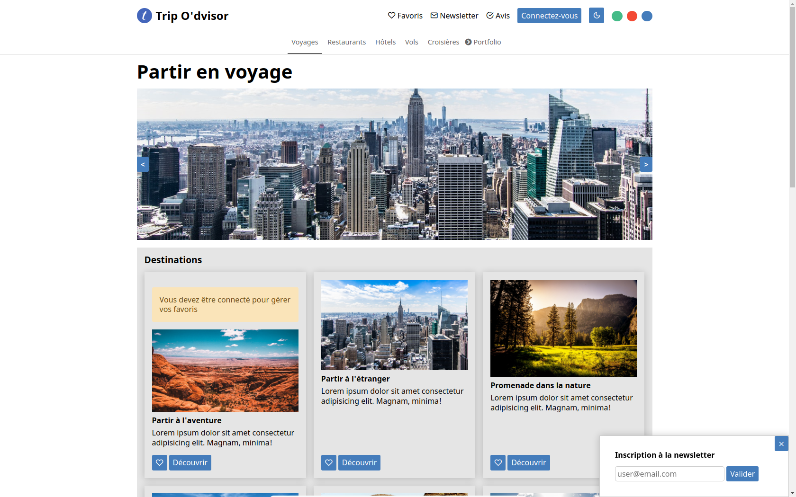

# Trip O'dvisor ✈️

Bienvenue dans le projet Trip O'dvisor ! L'objectif de ce projet est de mettre en place un site web de conseils touristiques en utilisant les langages HTML/CSS et Javascript (vanilla).

- [Essayez le projet](https://tripodvisor.vercel.app/)

## Description

Le projet Trip O'dvisor vise à créer une plateforme de recommandations touristiques où les utilisateurs peuvent trouver des avis, des guides et des bons plans pour différentes destinations, notamment les restaurants, les hôtels et plus encore.

## Fonctionnalités

- Changement de thème : Permet aux utilisateurs de basculer entre les thèmes sombres et clairs en cliquant sur le bouton approprié (la préférence de thème est enregistrée à l'aide d'un stockage local, de sorte que votre choix persiste d'une session à l'autre).

- Sélection de couleur de thème : Les utilisateurs peuvent choisir entre trois couleurs de thème (rouge, bleu, vert) en cliquant sur les pastilles de couleur.

- Slider d'images : Affiche un slider d'images de paysages de vacances et permet de passer à l'image suivante en cliquant sur les flèches latérales.
  
- Encart Newsletter : L'encart de newsletter apparaît en cliquant sur le lien "newsletter" en haut de la page.
  
- Messages d'erreur : Affiche des messages d'erreur pour des situations spécifiques, tels que les emails jetables dans l'encart Newsletter et la nécessité de se connecter pour gérer les favoris.
  
- Gestion des commentaires : Permet aux utilisateurs de filtrer les commentaires en fonction du nombre d'étoiles sélectionné.

## Screenshot

## Remarques

Ce projet a été réalisé dans le cadre d'un exercice pour pratiquer les langages HTML/CSS et Javascript (vanilla).
